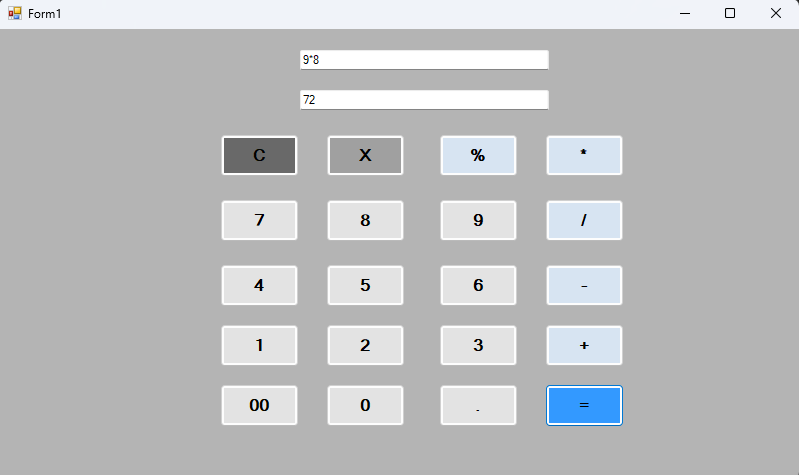

# Calculator-using-C#-form
A simple C# Windows Forms calculator that performs basic arithmetic operations. Features a user-friendly GUI, clear and backspace buttons, and clean, beginner-friendly code—perfect for learning Windows Forms development in C#.

## ✨ Features
- Addition, subtraction, multiplication, division
- Clean GUI
- Beginner-friendly code

## Screenshots

## How to Run
Open `index.sln` in Visual Studio and run the project.
